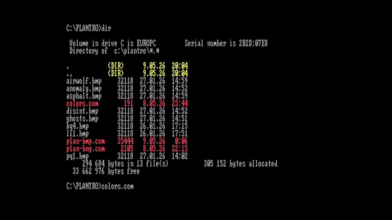
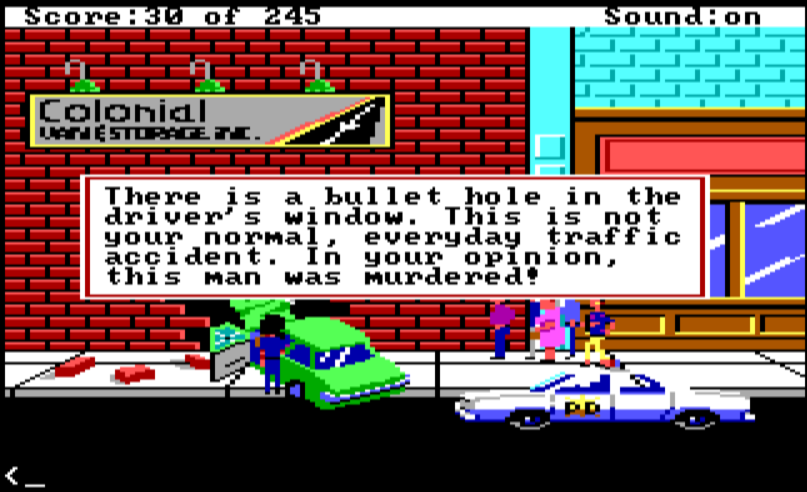
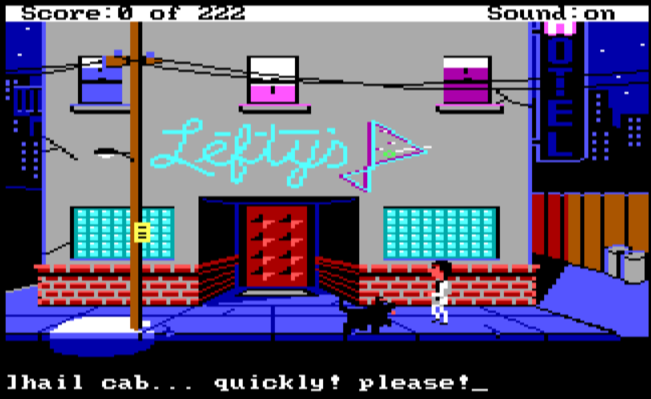
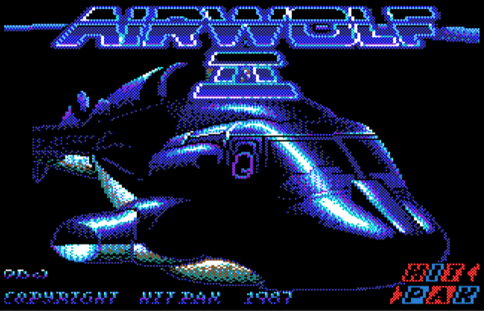
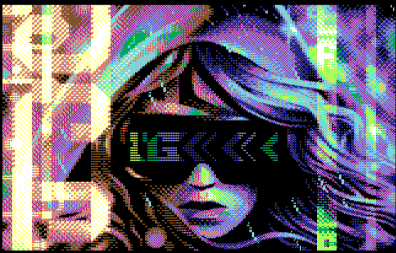

# PLAN-BMP

A 320×200 16-color BMP image viewer for **Plantronics ColorPlus** machines —
Schneider EuroPC, Schneider EuroPC II, Amstrad PC1640 (and any other PC with a
Plantronics-compatible CGA adapter).

By **Retro Erik** — [YouTube: Retro Hardware and Software](https://www.youtube.com/@RetroErik)


## About

Plantronics ColorPlus is a CGA-compatible video card from 1982 that adds a
second 16 KB graphics plane to provide a true **320×200×16-color** mode. It
was never widely supported in commercial software, but it lives on in two
European clone machines: the **Schneider EuroPC / EuroPC II** and the
**Amstrad PC1640**. PLAN-BMP is a small, self-contained DOS COM utility that
displays standard 4-bit (16-color) BMP files in this mode on real hardware.

PLAN-BMP has been verified on a real **Schneider EuroPC** (the GIFs in the
comparison gallery below are direct video captures of the EuroPC monitor
output, not emulator screenshots) and on the **Amstrad PC1640** in 86Box
with the internal video personality set to CD/CGA.

> **Capture chain.** EuroPC TTL RGBI → [MCE2VGA / MCE2HDMI](https://www.serdashop.com/)
> from Serdashop → Elgato 4K S capture card → MP4 → animated GIF.

A second build target (`-DTANDY`) produces a Tandy/PCjr-mode binary intended
for DOSBox testing — the only practical way to compare output without
hardware on hand.

## Real EuroPC hardware

<p>
<em>The ANSI loading splash on a real Schneider EuroPC (TTL RGBI output).</em><br>

</p>

<p>
<em><code>PLAN-16COLORS.COM</code> running on real EuroPC — the 4×4 chart diagnostic used to verify the plane-1 encoding.</em><br>

</p>

## Comparison gallery

For each test image, up to four cells are shown, left-to-right:

1. **Source BMP** — the file you feed to <code>PLAN-BMP</code>.
2. **EuroPC (live)** — animated GIF captured from a real Schneider EuroPC.
3. **EuroPC (dithered)** — same image with the 2×2 checkerboard dither
   toggled on (Enter).
4. **86Box (PC1640)** — reference capture from 86Box emulating an Amstrad
   PC1640 in CGA personality.

Where a column is missing, that capture wasn't taken.

### Police Quest 1 (Sierra)

| Source BMP | EuroPC (live) | EuroPC (dithered) | 86Box |
|---|---|---|---|
|  |  |  |  |

### Leisure Suit Larry 1 (Sierra)

| Source BMP | EuroPC (live) | EuroPC (dithered) | 86Box |
|---|---|---|---|
|  |  |  |  |

### Airwolf

| Source BMP | EuroPC (live) | 86Box (dithered) |
|---|---|---|
|  |  |  |

### Anomaly

| Source BMP | EuroPC (live) | EuroPC (dithered) | 86Box (dithered) |
|---|---|---|---|
|  |  |  |  |

### Disintegration

| Source BMP | EuroPC (live) | EuroPC (dithered) | 86Box (dithered) |
|---|---|---|---|
|  |  |  |  |

### Other test images (source BMP only)

| Asphalt | KQ4 | Last |
|---|---|---|
|  |  |  |

## How Plantronics 320×200×16 works

Two 16 KB planes share segment `B800h`. The standard plane (offset 0000h)
holds the **R+G** bits of each pixel; the extended plane (offset 4000h) holds
the **I+B** bits. Both planes use the normal CGA interlace (even rows at
offset 0000h, odd rows at +2000h) and pack 4 pixels per byte, 2 bits per
pixel. To enable the second plane the code unlocks the Plantronics mode
register at port `3DDh` (and on PC1640 also pokes `3D8h` and `3DBh`). On
EuroPC the extra writes are harmless, so a single binary works on both
machines.

| Plane | VRAM range | Bits | Encoding (per pixel) |
|-------|-----------|------|----------------------|
| 0 (standard) | `B800:0000`–`B800:3FFF` | R, G | `(R << 1) \| G` |
| 1 (extended) | `B800:4000`–`B800:7FFF` | I, B | `(B << 1) \| I` |

> **Note on plane 1.** The Sierra `PCPLUS.DRV` reference uses
> `(I << 1) \| B`. On real EuroPC and PC1640 hardware that produces swapped
> intensity. PLAN-BMP uses `(B << 1) \| I`, verified with the
> `PLAN-16COLORS.COM` 4×4 chart diagnostic on real hardware.

## Architecture

```
+-----------------+    +-----------------+    +-----------------+
| BMP file (DOS)  | -> | RAM analysis &  | -> | reveal in one   |
| 4-bpp 320x200   |    | offscreen plane |    | 32 KB blit to   |
+-----------------+    | encoding        |    | B800:0000-7FFF  |
                       +-----------------+    +-----------------+
                              |
                              v
                       +-----------------+
                       | nearest-color   |
                       | remap of BMP    |
                       | palette to 16   |
                       | fixed CGA RGBI  |
                       +-----------------+
```

1. **ANSI splash** (text mode 3) describes the program and stays on screen
   the entire time the BMP is being analysed and decoded.
2. **Palette analysis.** The 16 BMP palette entries are mapped to the 16
   fixed CGA RGBI colors using a saturation-aware nearest-color match
   (see below). Two maps are built so an optional 2×2 checkerboard dither
   pair can be picked at runtime.
3. **Decode** reads the BMP top-to-bottom (BMP rows are stored bottom-up)
   into an off-screen 32 KB plane buffer with the exact Plantronics layout.
4. **Reveal.** Mode switch to graphics, two `REP MOVSW` of 8 KB each copy
   the off-screen planes to VRAM. The image appears in one shot with no
   visible scan-out.
5. **View loop.** **Enter** toggles Sierra-style 2×2 checkerboard dithering
   (the BMP is re-decoded with the dither pair tables). Any other key
   restores text mode and exits.

## Saturation-aware nearest-color match

The fixed CGA RGBI palette has eight intense colors (light red, light green,
light blue, etc.) at component values 85/170/255 and eight non-intense colors
at 0/85/170. Plain Euclidean RGB distance picks the wrong anchor for BMPs
that use **pure** primaries instead of the IBM CGA standard:

```
pure (255, 0, 0)  -> Euclidean: dist² to dark red (170,0,0)   = 7225
                                 dist² to light red (255,85,85) = 14450
                  -> picks dark red, but light red is intended.
```

PLAN-BMP adds a saturation/brightness term:

```
dist = dR² + dG² + dB² + 2 · dMax²       where Max = max(R, G, B)
```

`dMax` rewards anchors whose dominant channel matches the input. For exact
IBM CGA palette inputs, `dMax = 0` everywhere and the standard mapping is
preserved. Pure-RGB primaries map to the intense palette as expected.

| Input RGB | best with `dMax` term | Picks |
|-----------|----------------------|-------|
| (170, 0, 0)   IBM red       | #4 dark red    | red ✓ |
| (255, 85, 85) IBM light red | #12 light red  | light red ✓ |
| (255, 0, 0)   pure red      | #12 light red  | light red ✓ |
| (0, 255, 0)   pure green    | #10 light green| light green ✓ |
| (255, 255, 0) pure yellow   | #14 yellow     | yellow ✓ |

## Loading flicker

The Plantronics build cycles the CGA border color (port `3D9h`) once per BMP
row during the decode pass — a small C64-style loading flicker that confirms
the program is busy. The border is reset to black after the reveal blit.

> The cycling is only visible in **graphics mode** (which has a wide CGA
> border). The very first decode runs while the ANSI splash is still in text
> mode 3, so the cycling is invisible there. Pressing **Enter** to toggle
> dithering re-decodes in graphics mode and the cycling becomes obvious.
>
> **86Box note.** 86Box does not faithfully render border-color writes during
> the text-mode splash, so on 86Box the loading flicker can appear absent
> even when the code is working. On real EuroPC hardware the border cycles
> as intended.

## Building

Requires [NASM](https://www.nasm.us/).

```cmd
:: Plantronics build (real hardware: EuroPC, EuroPC II, PC1640)
nasm -f bin PLAN-BMP.asm -o bin/PLAN-BMP.COM -l bin/PLAN-BMP.lst

:: Tandy/PCjr build (DOSBox testing only — needs machine=tandy)
nasm -f bin -DTANDY PLAN-BMP.asm -o bin/TDY-BMP.COM -l bin/TDY-BMP.lst
```

The VS Code task **"Build COM (NASM)"** builds the active source as a
Plantronics binary; **"Build COM Tandy (NASM)"** sets `-DTANDY`.

## Running

```
PLAN-BMP filename[.bmp]
PLAN-BMP /?         show help
```

`.bmp` is appended automatically when no extension is given.

In the view loop:

| Key | Action |
|-----|--------|
| Enter | Toggle Sierra-style 2×2 checkerboard dithering |
| any other | Restore text mode and exit |

## BMP requirements

- 4-bit (16-color) palette, uncompressed (`BI_RGB`)
- Exactly 320×200, top-down or bottom-up (negative height supported)
- Standard 54-byte header + 16×4-byte BGRA palette = 118 bytes before pixels
- Row stride 160 bytes (already DWORD-aligned)

Files that don't match are rejected with a one-line error.

## File structure

| File | Purpose |
|------|---------|
| `PLAN-BMP.asm` | NASM source for both Plantronics and Tandy builds |
| `PLAN-16COLORS.asm` | 4×4 color-chart diagnostic used to verify plane encoding on real hardware |
| `Images for testing/` | Sample BMPs (Sierra titles, demos, photos) |
| `Screenshots/EuroPC/` | Captures from a real Schneider EuroPC (PNGs + animated GIFs) |
| `Screenshots/86box/` | Reference screenshots from 86Box emulation (PC1640 in CGA personality) |

## Credits

- **Retro Erik** — code, hardware verification on Schneider EuroPC and
  Amstrad PC1640, and 86Box screenshots.
- Plantronics plane-1 encoding corrected against the Sierra
  `foss_sci_drivers` PCPLUS.DRV reference using the `PLAN-16COLORS`
  diagnostic on real hardware.

## License

MIT — see source file headers.

---

## YouTube

For more retro computing content, visit my YouTube channel **Retro Hardware and Software**:
[https://www.youtube.com/@RetroErik](https://www.youtube.com/@RetroErik)
